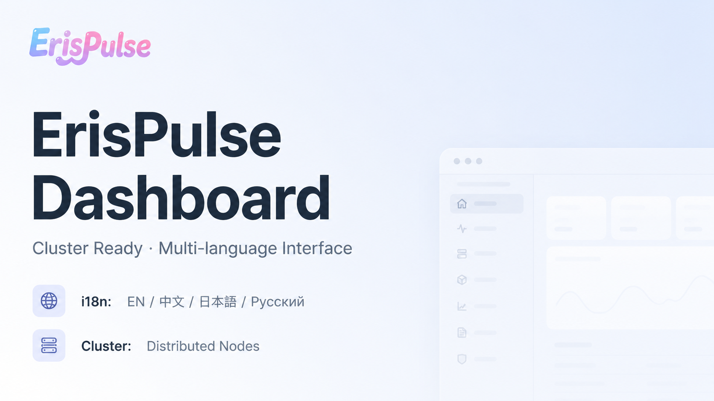

<div align="center">



# ErisPulse Dashboard

**ErisPulse Web Management Panel Module**

[](https://pypi.org/project/ErisPulse-Dashboard/)

**English** | [简体中文](README.zh-CN.md) | [繁體中文](README.zh-TW.md) | [日本語](README.ja.md) | [Русский](README.ru.md)

</div>

---

## Overview

ErisPulse Dashboard is the official Web management panel module for the ErisPulse framework. Monitor framework status, manage modules and adapters, view real-time event streams, edit configurations, and manage storage data — all through your browser, with no external frontend build tools required.

## Key Features

- **System Overview** — Framework version, uptime, adapter and module status at a glance
- **Bot Management** — View connection status and info for all platform bots
- **Topology Graph** — Visualize modules / adapters / bots with ownership links of their resources and scope bindings (requires ErisPulse 2.8.0+)
- **Module Management** — Enable, disable, load modules and adapters
- **Plugin Store** — Browse remote package repository and install dependencies online
- **Master System** — Manage framework owners with global or per-platform permissions, with master provider ownership display
- **Scope Management** — Three-dimension control plane (module bindings / identity admission / outbound restrictions), global default-allow switch, runtime stats, runtime-binding ownership management, and a judgement tester (requires ErisPulse 2.8.0+)
- **Command Management** — Edit command rules with owner module badge, ACL user black/whitelists, parameter overrides (master / hidden), and command transform
- **Configuration** — View and modify framework configuration at runtime
- **Storage Management** — View, edit, and delete persistent key-value data
- **Remote Restart** — Safely restart the framework from the web interface
- **Cluster Management** — Multi-node cluster monitoring and management
- **Unified UI Components** — Custom dropdowns and searchable multi-selects replace native controls while staying backward compatible

## Installation

```bash
pip install ErisPulse-Dashboard

# China mirror
pip install -i https://pypi.tuna.tsinghua.edu.cn/simple ErisPulse-Dashboard
```

After installation, the module will be automatically discovered and loaded by the ErisPulse framework.

## Access URL

After installing and starting the ErisPulse framework, open in your browser:

```
http://<host>:<port>/Dashboard/
```

Where `<host>` and `<port>` are the ErisPulse framework's listen address and port.

## Authentication

The module automatically generates an access token on first load and outputs it to the framework logs:

```
[Dashboard] ╔══════════════════════════════════════════════╗
[Dashboard] ║           ErisPulse Dashboard                ║
[Dashboard] ║  URL: /Dashboard                             ║
[Dashboard] ║  Token: <your-token-here>                    ║
[Dashboard] ║  Token saved to config: Dashboard.token       ║
[Dashboard] ╚══════════════════════════════════════════════╝
```

To prevent token leakage, it is only shown in plaintext on first generation.

Enter this token when opening the Dashboard to authenticate. You can also pre-set the token in the config file:

```toml
[Dashboard]
token = "your-custom-token"
title = "ErisPulse Dashboard"
max_event_log = 500
```

## Configuration

| Key | Type | Default | Description |
|-----|------|---------|-------------|
| `Dashboard.title` | `str` | `"ErisPulse Dashboard"` | Panel title |
| `Dashboard.max_event_log` | `int` | `500` | Maximum event log entries to retain |
| `Dashboard.token` | `str` | Auto-generated | Access token |

## License

MIT

## 字体归属 / Font Attribution

Dashboard 默认使用系统字体栈（覆盖中/繁/日/俄/英全部界面语言，零外部请求）。

用户可在 **设置 → 外观** 中上传自定义字体（`.ttf` / `.otf` / `.woff` / `.woff2`，≤15MB）自由替换界面字体；上传的字体保存在服务端 `static/res/fonts_upload/`，可随全局同步分发到所有设备。

字体文件的版权归各自作者所有，使用上传功能时请确认你拥有相应字体的合法授权。
