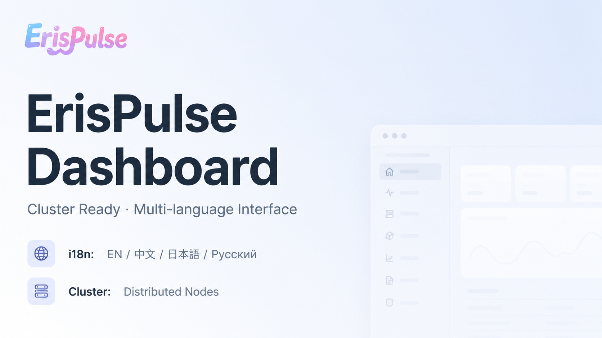

<div align="center">



# ErisPulse Dashboard

**Модуль веб-панели управления ErisPulse**

[](https://pypi.org/project/ErisPulse-Dashboard/)

[English](README.md) | [简体中文](README.zh-CN.md) | [繁體中文](README.zh-TW.md) | [日本語](README.ja.md) | **Русский**

</div>

---

## Обзор

ErisPulse Dashboard — официальный модуль веб-панели управления для фреймворка ErisPulse. Отслеживайте состояние фреймворка, управляйте модулями и адаптерами, просматривайте поток событий в реальном времени, редактируйте конфигурацию и управляйте данными хранилища — всё через браузер, без необходимости во внешних инструментах сборки фронтенда.

## Основные возможности

- **Обзор системы** — Версия фреймворка, время работы, статус адаптеров и модулей с первого взгляда
- **Управление Bot** — Просмотр статуса подключения и информации о ботах на всех платформах
- **Управление модулями** — Включение, отключение, загрузка модулей и адаптеров
- **Магазин плагинов** — Просмотр удалённого репозитория пакетов и онлайн-установка зависимостей
- **Система владельцев** — Управление владельцами фреймворка с глобальными или платформенными правами
- **Конфигурация** — Просмотр и изменение конфигурации фреймворка во время выполнения
- **Управление хранилищем** — Просмотр, редактирование и удаление постоянных данных ключ-значение
- **Удалённая перезагрузка** — Безопасная перезагрузка фреймворка через веб-интерфейс
- **Управление кластером** — Мониторинг и управление многоузловым кластером

## Установка

```bash
pip install ErisPulse-Dashboard

# Зеркало в Китае
pip install -i https://pypi.tuna.tsinghua.edu.cn/simple ErisPulse-Dashboard
```

После установки модуль будет автоматически обнаружен и загружен фреймворком ErisPulse.

## URL доступа

После установки и запуска фреймворка ErisPulse откройте в браузере:

```
http://<host>:<port>/Dashboard/
```

Где `<host>` и `<port>` — адрес и порт прослушивания фреймворка ErisPulse.

## Аутентификация

Модуль автоматически генерирует токен доступа при первой загрузке и выводит его в журнале фреймворка:

```
[Dashboard] ╔══════════════════════════════════════════════╗
[Dashboard] ║           ErisPulse Dashboard                ║
[Dashboard] ║  URL: /Dashboard                             ║
[Dashboard] ║  Токен: <your-token-here>                    ║
[Dashboard] ║  Токен сохранён в конфиг: Dashboard.token     ║
[Dashboard] ╚══════════════════════════════════════════════╝
```

Во избежание утечки токен отображается в открытом виде только при первом создании.

Введите этот токен при открытии Dashboard для аутентификации. Вы также можете предварительно задать токен в файле конфигурации:

```toml
[Dashboard]
token = "your-custom-token"
title = "ErisPulse Dashboard"
max_event_log = 500
```

## Параметры конфигурации

| Ключ | Тип | По умолчанию | Описание |
|------|-----|-------------|----------|
| `Dashboard.title` | `str` | `"ErisPulse Dashboard"` | Заголовок панели |
| `Dashboard.max_event_log` | `int` | `500` | Максимальное количество записей журнала событий |
| `Dashboard.token` | `str` | Авто-генерация | Токен доступа |

## Лицензия

MIT
